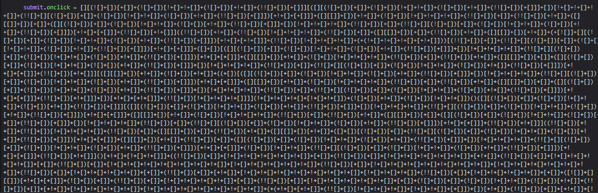
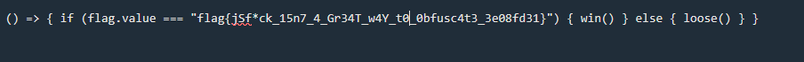

Il sito ci fornisce l'opzione di inviare la flag e verificare se è corretta, ma qualsiasi cosa inviamo ci dice "Wrong flag"

Se osserviamo però il source code notiamo una parte interessante:

Sembra proprio essere JSFuck, ci basta inserirlo su un decoder come [questo](https://enkhee-osiris.github.io/Decoder-JSFuck/) per ottenere la flag:

**flag{jSf*ck_15n7_4_Gr34T_w4Y_t0_0bfusc4t3_3e08fd31}**

